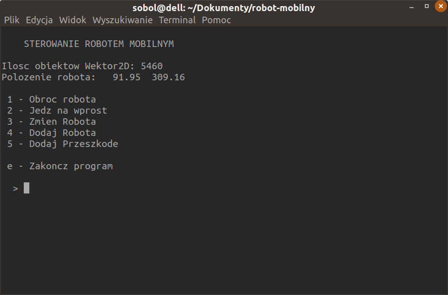
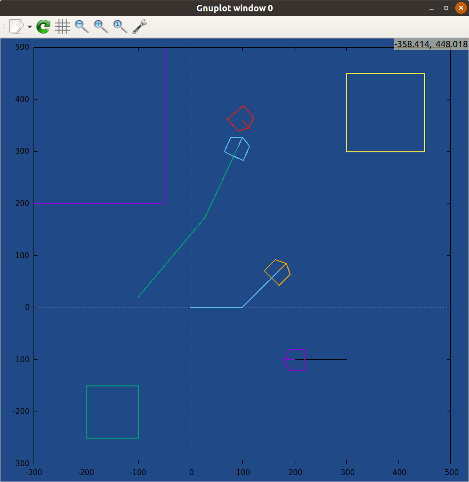

# Robot simulation
---

Robot simulation is an application that allows to control multiple mobile robots
on a board plotted in GNUPlot. You can add robots, obstacles and detect collision
betweenn them.
This project was made on univesity class to learn about OOP and OOD. New
graphic objects are made in `Fabryka` class which uses two design patterns:
singleton and factory.

---

To compile this program simply write `make` command to terminal.
Make sure you have `gnuplot` installed.
It works only on GNU/Linux distributions.

---

`screenshots`

